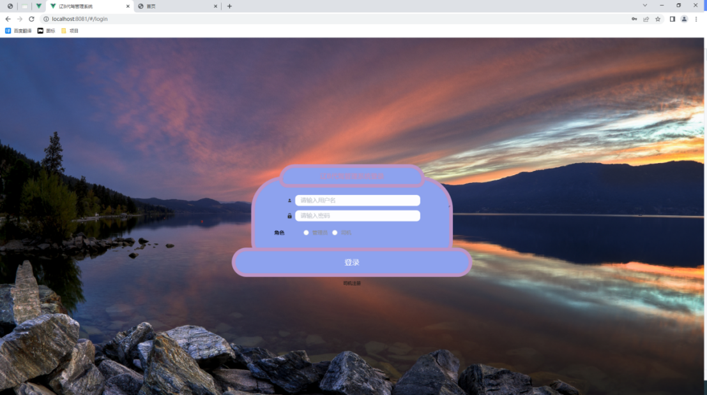
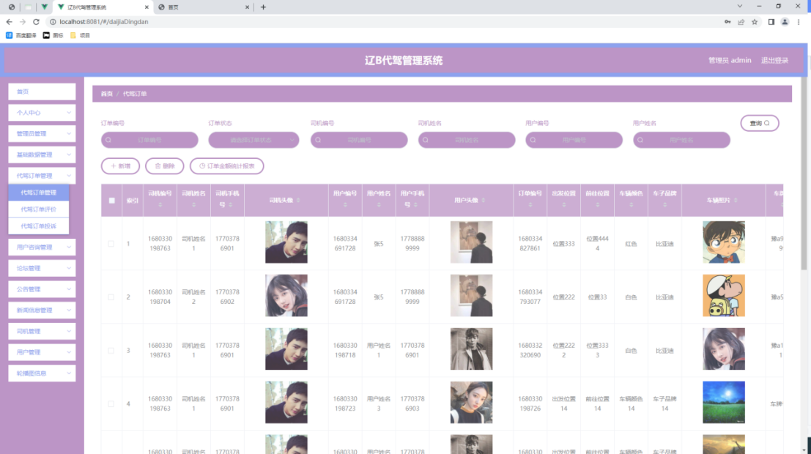
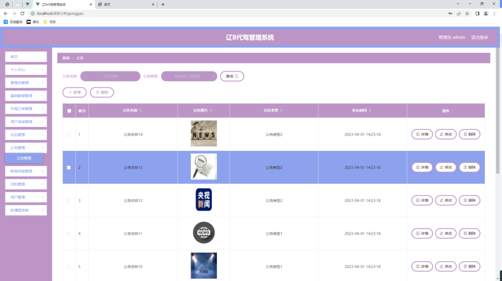
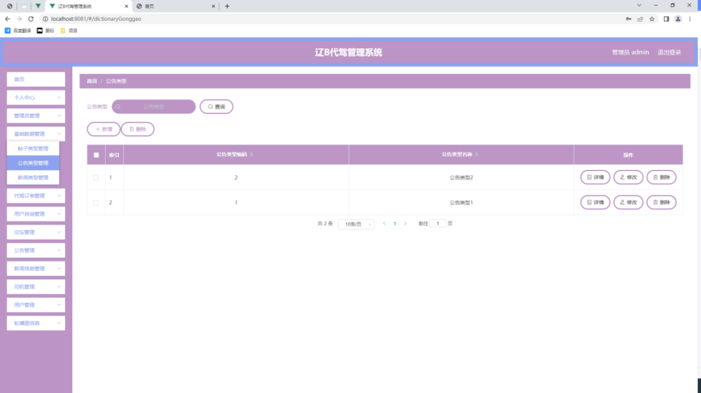
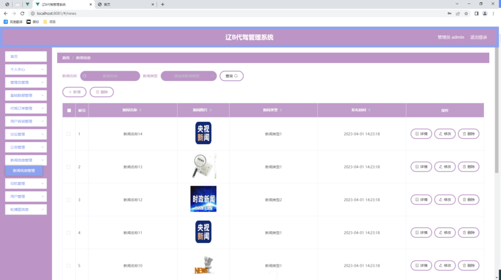
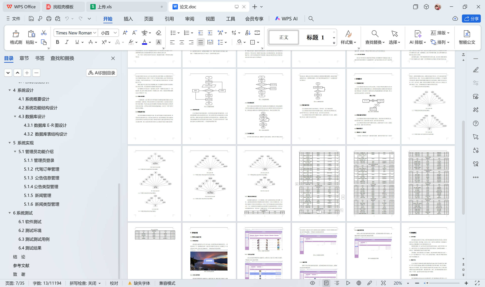

# springboot243-基于SpringBoot的辽B代驾管理系统

>  博主介绍：
>  Hey，我是程序员Chaers，一个专注于计算机领域的程序员
>  十年大厂程序员全栈开发‍ 日常分享项目经验 解决技术难题与技术推荐 承接各类网站设计，小程序开发，毕设等。
>  【计算机专业课程设计，毕业设计项目，Java，微信小程序，安卓APP都可以做，不仅仅是计算机专业，其它专业都可以】

## 3000套系统可挑选，获取链接：https://chaerspol.github.io/

<b>QQ【获取完整源码】：674456564</b>

<b>QQ群【获取完整源码】：1058861570</b>

### 系统架构

> 前端：html | js | css | jquery | vue
>
> 后端：springboot | mybatis
> 
> 环境：jdk1.8+ | mysql | maven

# 一、内容包括
包括有  项目源码+项目论文+数据库源码+答辩ppt+远程调试成功

# 二、运行环境

> jdk版本：1.8 及以上； ide工具：IDEA； 数据库: mysql5.7及以上；编程语言: Java

# 三、需求分析

**3.1系统可行性分析**

需要使用大部分精力开发的辽B代驾管理系统为了充分降低开发风险，特意在开发之前进行可行性分析这个验证系统开发是否可行的步骤。本文就会从技术角度，经济角度，还有用户使用的程序的运行角度进行综合阐述。

**3.1.1 技术可行性分析**

开发程序选择的是面向对象的，功能强大的，简单易用的Java程序设计语言，数据库的开发工具使用到了Mysql数据库，由于自己之前接触过一些简单的程序开发方面的设计作品，所以对Myeclipse工具的使用比较熟练，对于数据库的操作技巧也有一定的积累。另外，程序开发需要在自己电脑上安装的软件并不多，在win7操作系统的大环境下，能够完全搭建好程序开发的操作环境，比如Myeclipse工具，Mysql数据库工具，游览器，以及处理程序图片的Photoshop工具等都能安装在自己的电脑上。总的说来，开发这个程序在技术上是可以实现的。

**3.1.2 经济可行性分析**

开发出来的程序并不是朝着商业程序的方向进行设计开发的，它只是作为一个毕业设计项目进行开发，主要用于检验学生在学校所学知识的一个检验，也锻炼学生运用网络，图书等工具进行自学的能力。所以开发这个程序软件并不会涉及到经济上面的开销，在开发软件的选择上也不会额外付费安装软件，在开发软件的官网上面就可以下载需要的软件，并根据提示的安装步骤安装软件到自己的电脑上面。总的说来，开发这个程序在经济上也不存在经费支出。

**3.1.3 运行可行性分析**

因为这个程序软件从开始开发到开发截止都是根据用户的需求进行定制，考虑到此程序软件是面向广大普通操作用户，鉴于他们的知识文化水平，特意开发出一个可操作性强的，能够很容易让使用用户上手的，具有可视化操作界面的一个程序软件。总的说来，这个程序站在用户运行程序的角度上分析，是不存在操作难的问题的。用户只要打开程序就可以免去专人培训进行程序功能操作。
经过上面从技术的角度，从经济的角度，从程序运行的角度这三个角度分析现打算开发的程序，可以得出该程序软件是可以进行开发操作的。

**3.2系统性能分析**

**3.2.1 系统安全性**

程序在使用中是不允许其他访问者随意窃取程序里面的隐秘信息，也不允许其他操作者越权操作其他管理用户操作的功能，要真正杜绝这些现象就必须在程序开发之前把程序的安全性给考虑进去。
比如现在很多程序都会把用户注册的功能给考虑进去，让用户在注册页面功能区填写自己的个人信息，这些数据信息涵盖了用户本人的姓名，用户对程序登录设置的密码，用户经常使用的邮箱，用户的常用联系方式还有用户的所住地址等信息，这些信息都是设计到用户本人的隐私，那么这些信息在传输给程序后台时，是需要进行管理并保存至对应的数据库文件里面。要是有人恶意窃取程序的数据信息，也就会让那些注册了此程序软件的用户的个人隐秘信息都会遭到泄露。这些信息落入其他不法分子手里，他们极有可能根据用户的隐私信息去骚扰用户，并把这些信息用于各种商业用途谋取其他非法的利益。所以数据安全性是一个系统能不能使用的首要标准。

**3.2.2 数据完整性**

数据完整性是确保数据信息是否具有可靠性，是否具有参考价值的一个重要因素，数据信息只描述一部分，或者必有的数据信息反而为空等现象都是代表着这个数据信息不完整，有数据缺陷，这是个很严肃的问题，因为这样的数据信息跟垃圾信息没什么两样。
说到数据完整性，不得不提最常用的程序表单功能。这些表单主要就是提取广大用户的数据信息的，需要广大用户根据表单上的要求，填写自己的姓名信息，以及自己的联系方式信息，有些也会有额外的信息填写要求，有必须要填的选项，也有不需要必填的选项。假如广大用户为了保护自己的隐私，或者不想受到其他人的骚扰，不填写必填项等信息，广大用户在最后提交此表单的时候，往往都是提交不了的。
数据完整性不仅仅限于登记的数据要完整，它也需要程序里面的所有数据信息之间存在关联，而且这种联系也是要求不能出差错的。
由于数据表之间也会存在一定的联系，所以同一个数据也会出现在另一个表格里面，那么这两个表格记录的同一个数据应该是一样的。不能够是同样的数据信息在不同表中不一样。

**3.2.3系统可扩展性**

一切事物都是一直在发展，程序员开发软件也需要带着发展的思维去进行软件开发操作，这样的话，开发出来的程序在应对管理所需时，也会相对应的进行程序升级与更新。不论是功能完善还是数据库升级都能在原来的基础上对原有程序进行迭代升级。让开发出来的程序能够走得越来越远。这也是广大用户对程序软件的使用要求。

**3.3系统流程分析**

管理员假如要操作系统提供的功能，那么管理员就要在系统的登录界面，填写管理员登录的账号信息，填写相应的密码信息，管理员需要保证这两者能够验证身份的账号以及密码信息的正确性，这样管理员就可以通过登录界面进入系统后台操作界面。图3.1就是开发的程序软件辽B代驾管理系统它的操作流程图。

# 四、功能模块

辽B代驾管理系统针对管理员设置的功能有：添加并管理各种类型信息，管理用户账户信息，管理代驾订单信息，管理公告信息等内容。

辽B代驾管理系统针对用户设置的功能有：查看并修改个人信息，查看代驾订单信息，查看公告信息等内容。

# 五、效果图展示【部分效果图】

图5.1 管理员登录页面【系统登录功能是程序必不可少的功能，在登录页面必填的数据有两项，一项就是账号，另一项数据就是密码，当管理员正确填写并提交这二者数据之后，管理员就可以进入系统后台功能操作区。下图就是管理员登录页面。】

图5.2  代驾订单管理页面【项目管理页面提供的功能操作有：查看代驾订单，删除代驾订单操作，新增代驾订单操作，修改代驾订单操作。下图就是代驾订单管理页面。】

图5.3 公告信息管理页面【公告信息管理页面提供的功能操作有：新增公告，修改公告，删除公告操作。下图就是公告信息管理页面。】

图5.4 公告类型列表页面【公告类型管理页面显示所有公告类型，在此页面既可以让管理员添加新的公告信息类型，也能对已有的公告类型信息执行编辑更新，失效的公告类型信息也能让管理员快速删除。下图就是公告类型管理页面。】

图5.5新闻管理页面【如图5.5显示的就是新闻管理页面，此页面提供给管理员的功能有：新增新闻,修改新闻,删除新闻。】

 <b>完整文章</b>
 
 
 

## 3000套系统可挑选，获取链接：https://chaerspol.github.io/

<b>QQ【获取完整源码】：674456564</b>

<b>QQ群【获取完整源码】：1058861570</b>

